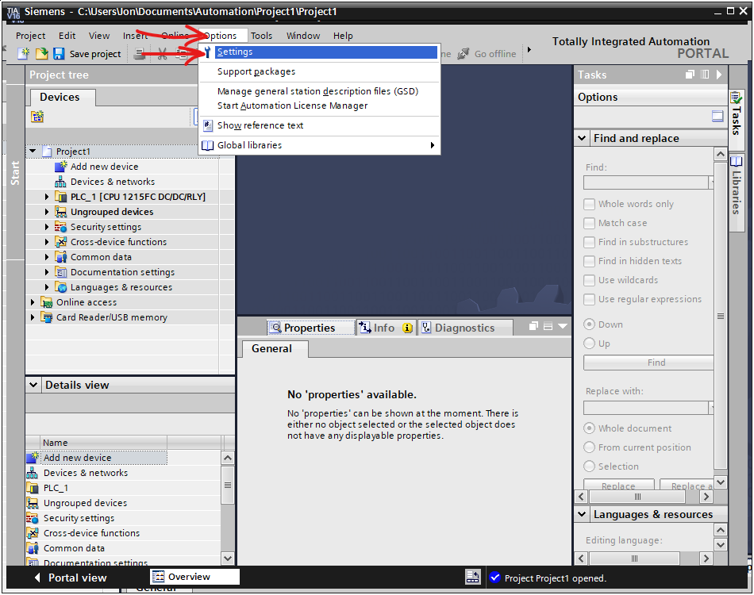
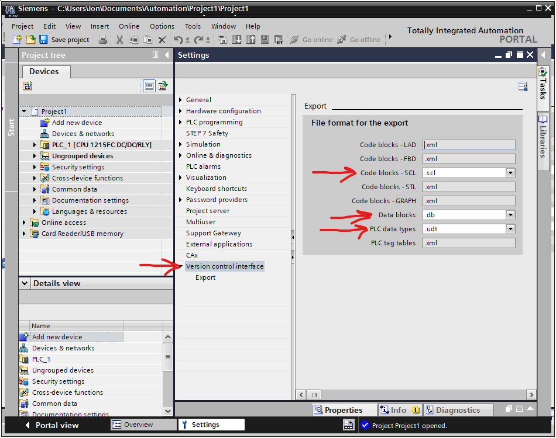

# Installation

## TIA Portal (V16)
This project was largely tested with TIA Portal V16. Once installed you need to do two things:

  1. Setup the export rules for your TIA portal install. Configuration menus for these are located under `Options -> Settings -> Version control interface`. Set the export format of datablocks to `.db` files and set user-defined data types to `.udt` files. See the following pictures:
  
  

  2. Setup the version control export for your particular project. This involves consulting the property tree of the project itself for a given PLC and setting up an export directory then running an action to synchronize to a folder. The product of this step may be consumed by these analysis tools. 

I found [this youtube video](https://www.youtube.com/watch?v=Jm-KNwNnrgQ) helpful in demonstrating both the act of exporting as well as some other useful tools for this kind of work.

## Python
1. Install python3.9 and pip.
   * On Ubuntu, you can often use the package manager `sudo apt install python3.9 python3-pip`
   * On Windows (if not using WSL), consider using the the stable release installers from `https://www.python.org/downloads/windows/` to get started. I've had some coworkers report that the python versions from the Windows store added a layer of headache to managing pip packages.
2. Clone and check-out the project.
3. Install pipenv and the required dependencies. Navigate to the checked-out directory and:
   * `python3 -m pip install pipenv`
   * `pipenv install`
4. Run tests
   * `pipenv run python -m pytest`

