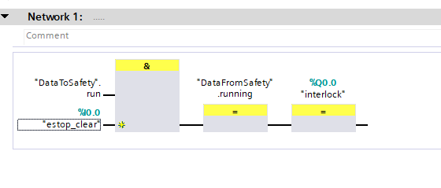
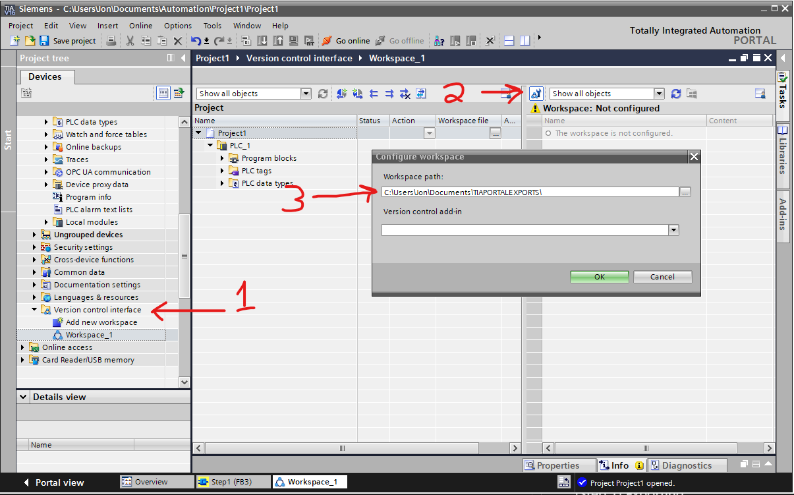
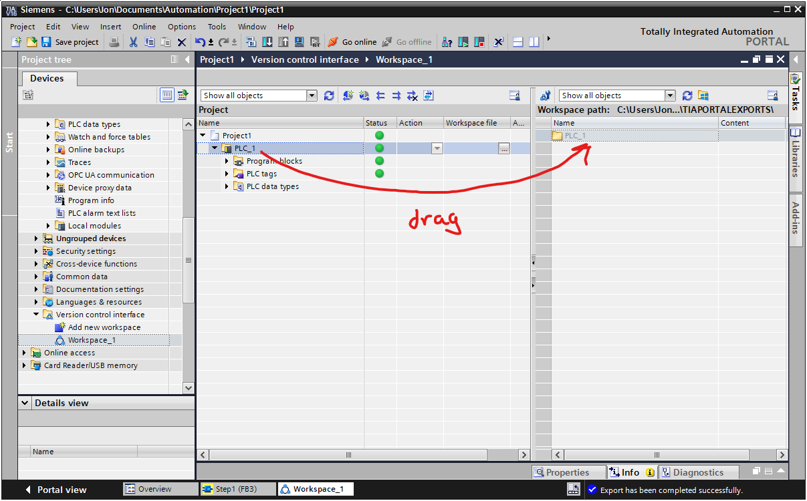

# Intro
This document attempts to walk you through the process of analyzing a contrived example program. Make sure you've run through the [install instructions](install.md) first.

If you don't have TIA Portal, the sources of the exported project are available under **TODO** and you can start from **Importing and Modeling**.

## The Project

We're going to examine a simple system wherein we have:
 1. A dangerous machine of some sort
 2. An emergency stop system managed by the PLC in software

The machine's primary software also runs on the PLC and communicates with the safety task by passing data into a `DataToSafety` DB interface and retrieving state from a `DataFromSafety` interface. For our purposes, the user program only passes a "start request" into our safety system.

The tools of this package are limited to the analysis of the safety program and the memory it reads.

To start with, we have the following IO points:
 * estop_clear: Input(bool) := When true, the estop is **not engaged** and the machine can run.
 * interlock: Output(bool) := When true, the safety program enables the operation of the machine.

Enough of the BS, here's the first stab at the software:


We and-together the request to run with the status of the estop system and feed that directly to the machine enable (interlock) and back to our user program.

## (Step 1) Exporting

Now we need to get the textual representation of our program out of TIA. Without any fancy API shennanigans or installing of add-ins you can accomplish this by:

 1. Going to the `version control interface` tab in the project property tree. Add a new workspace.
 2. Open the workspace and click on the little configuration button on the right pane of the screen.
 3. Designate a location where you can export to. 



 4. Drag the PLC whose program you want to analyze from the left to the right pane and it should automatically start exporting.



## (Step 1) Importing and Modeling

Now we get to the fun part. We'll create a python file. I'm putting this in the test folder so I can ensure it still works, but you can put it wherever as long as you can get at the `fbdplc` modules.


The `assertions` variable a list of mathematical expressions that represent your program. It's quite verbose because it has to namespace each variable to be unique, but it should give you a nice hint at what's going on. I've added some annotations to the output below:

```python
import fbdplc.project
import glob # Used to search for and aggregate files
import pprint # pretty printing
import z3

def step1():
    project = fbdplc.project.ProjectContext()

    # You'll need to fill this our for your project. When possible, limit it to
    # just the files you need because we may not be able to handle anything that
    # can come out of TIA Portal. For the example, though, I use glob().
    project.udt_srcs = []
    project.db_srcs = glob.glob('testdata/intro/PLC_1/Program blocks/*.db')
    project.tag_srcs = glob.glob('testdata/intro/PLC_1/PLC tags/*.xml')
    project.fb_srcs = glob.glob('testdata/intro/PLC_1/Program blocks/*.xml')

    # In this case, we just want to look at the FB routine called 'Step1'
    # that corresponds with the picture in intro:
    project.entry_point = 'Step1'

    model = fbdplc.project.build_program_model(project)
    pprint.pprint(model.assertions)

# ...snip...
```

The printed output of which looks like (annotations, #, mine):

```
[# This is the AND gate from our example: It just says that the output of
 # that gate is the AND of in1 and in2.
 And($()Step1:(3:25)A:in1, $()Step1:(3:25)A:in2) == $()Step1:(3:25)A:out,
 And($()Step1:(3:26)Coil:in == $()Step1:(3:26)Coil:operand,
    $()Step1:(3:26)Coil:in == $()Step1:(3:26)Coil:out),
 And($()Step1:(3:27)Coil:in == $()Step1:(3:27)Coil:operand,
    $()Step1:(3:27)Coil:in == $()Step1:(3:27)Coil:out),

 # Note this variable that doesn't start with a '$': It's one of our top
 # level variables.
 DataToSafety.run#0 == $()Step1:(3:25)A:in1,
 estop_clear#0 == $()Step1:(3:25)A:in2,
 $()Step1:(3:25)A:out == $()Step1:(3:26)Coil:in,
 DataFromSafety.running#1 == $()Step1:(3:26)Coil:operand,
 DataFromSafety.running#0 == $()Step1:(3:26)Coil:_old_operand,
 $()Step1:(3:26)Coil:out == $()Step1:(3:27)Coil:in, 
 interlock#1 == $()Step1:(3:27)Coil:operand,
 interlock#0 == $()Step1:(3:27)Coil:_old_operand]
 ```

You wont typically need to look at this structure, but I think it's useful to see there isn't any magic going on. If you squint real hard you can see the original program.

## (Step 1) Analysis

To be dangerous with this system, you should understand the basics of Z3. I recommend [this python introduction](https://ericpony.github.io/z3py-tutorial/guide-examples.htm) [1].

Full source at [tests/integration/test_intro_project.py](../tests/integration/test_intro_project.py).

Now what? Well, by golly, you could try to ***test*** your code. Don't get too excited. Let's start with some high level tools:

```python
# ...snip...
import fbdplc.analysis

def unit_test_step1(model: ProgramModel):
    # Test a case where all is well:
    fbdplc.analysis.exec_and_compare(
        model,
        # inputs
        {'DataToSafety.run': True, 'estop_clear': True},
        # outputs
        {'DataFromSafety.running': True, 'interlock': True}
    )
    # Test a case where the estop is pressed
    fbdplc.analysis.exec_and_compare(
        model,
        # inputs
        {'DataToSafety.run': True, 'estop_clear': False},
        # outputs
        {'DataFromSafety.running': False, 'interlock': False}
    )
    # Whoops... this won't work but it shows you what happens:
    fbdplc.analysis.exec_and_compare(
        model,
        # inputs
        {'DataToSafety.run': False, 'estop_clear': True},
        # outputs
        {'DataFromSafety.running': False, 'interlock': True}
    )
# ...snip...
```

`exec_and_compare` attempts to symbolically execute your code. You specify the inputs and figure out a solution to the outputs. **NOTE** If you don't constrain the inputs, it's possible that you could have several solutions: Imagine that I didn't assert the value of `estop_clear`. In this case `interlock` could be either true or false and the underlying solver will try to make your output assertions work.

Inputs constrain the initial value of a variable in your program. Outputs check the final value.

You'll note that the last test doesn't pass. Here's the output:
```
E               AssertionError: EXEC error: expected var interlock to be True but got False
E               # ...snip...
E               [$()Step1:(3:25)A:in1 = False,
E                DataFromSafety.running#1 = False,
E                $()Step1:(3:27)Coil:out = False,
E                estop_clear#0 = True,
E                $()Step1:(3:25)A:out = False,
E                $()Step1:(3:27)Coil:_old_operand = False,
E                DataFromSafety.running#0 = False,
E                $()Step1:(3:27)Coil:in = False,
E                DataToSafety.run#0 = False,
E                interlock#0 = False,
E                $()Step1:(3:26)Coil:_old_operand = False,
E                interlock#1 = False,
E                $()Step1:(3:25)A:in2 = True,
E                $()Step1:(3:26)Coil:operand = False,
E                $()Step1:(3:26)Coil:in = False,
E                $()Step1:(3:27)Coil:operand = False,
E                $()Step1:(3:26)Coil:out = False]
E               # ...snip...
```
It tells you at the top which variable didn't match expections, but it also shows you a full print out of the internal program state. You can use this to help huntdown bugs.

This is already pretty useful. You could write tests and have them run in your CI systems. Utilizing Z3, though, we can do some more potent testing by writing our own mathematical expressions that overlay onto the model you generated from your program.

It's a good idea to have a "specification" of system behavior when dealing with programs that try to make safety guarantees. Often we can find simple properties that we want to be true. In our case, we might say `"If the estop is not clear, then interlock should not be true"`. We can see this is true for our simple program, but Z3 lets us state this assertion and then *prove* that it holds by, in essence, trying all possible inputs and hunting for ways to make your assertion fail.

```python
# ...snip...
def assertion_step1(model: ProgramModel):
    # The optional second argument specifies whether you want the value of
    # the symbol at the start of the program (index == 0) or at the end (the default).

    # Read the initial value of estop_clear. These are just Z3 variables.
    estop_clear = model.global_mem.read('estop_clear', 0)
    # Read the final value of interlock
    interlock = model.global_mem.read('interlock')
    print(type(estop_clear), type(interlock))

    # Form your own assertion: !estop_clear -> !interlock
    estop_assertion = z3.Implies(z3.Not(estop_clear), z3.Not(interlock))

    success, counter_example = fbdplc.analysis.run_assertions(model,
                                                              [],
                                                              [estop_assertion, ])
    assert success, f"Assertion failed. Counter example: {counter_example}"
# ...snip...
```

As it turns out our assertion passes! You can manually specify variables to match the names you saw printed in the assertions list earlier in this tutorial, but the `global_mem.read` function gives you an easy way to extract top level variables by name.

One last thing for now: Imagine we made a bad assertion, say, `"If estop is clear then interlock is true"`. This shouldn't pass because the user program also has to assert `DataToSafety.run` before we give interlock. Let's see if we can show that with `run_assertions`:

```
E       AssertionError: Assertion failed. Counter example: [$()Step1:(3:25)A:in1 = False,
E          DataFromSafety.running#1 = False,
E          $()Step1:(3:27)Coil:out = False,
E          $()Step1:(3:25)A:out = False,
E          estop_clear#0 = True,
E          $()Step1:(3:27)Coil:_old_operand = False,
E          DataFromSafety.running#0 = False,
E          $()Step1:(3:27)Coil:in = False,
E          DataToSafety.run#0 = False,
E          interlock#0 = False,
E          $()Step1:(3:26)Coil:_old_operand = False,
E          interlock#1 = False,
E          $()Step1:(3:25)A:in2 = True,
E          $()Step1:(3:26)Coil:operand = False,
E          $()Step1:(3:26)Coil:in = False,
E          $()Step1:(3:26)Coil:out = False,
E          $()Step1:(3:27)Coil:operand = False]
E       assert False
```

Bam. Our assertion failed. We see that `estop_clear` is `true`, but `interlock#1` (the final value of interlock) is `false`. If we look a little more we indeed see that `DataToSafety.run` is `false`. Now we must carefully examine both the assertions and our program to figure out where the disagreement was. In our case, the test itself was bad but maybe in your case it roots out a bug.

## References

[1] https://ericpony.github.io/z3py-tutorial/guide-examples.htm