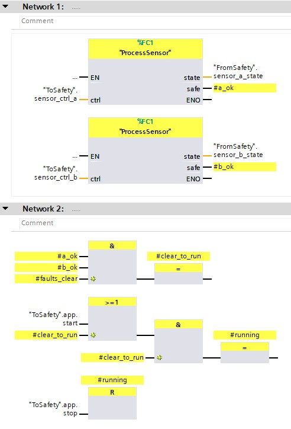

# Function Block Diagram Analysis With Z3

:warning: **This is an experimental tool for analyzing safety programs, but it isn't safety rated itself!** Please don't rely on this alone for your system designs.

## Forward
Siemens Programmable Logic Controllers (or PLCs) are frequently used in the construction of "safety systems" that mitigate risks to people, but the language and environment used to create software for these systems makes traditional software testing hard. Playing with formal methods in other domains (FPGAs) led me to ask "Why the hell don't we have these tools here?"

This **experimental** project is comprised of a set of tools that can:
 - consume the serialized (XML) form of a "function block diagram" from Siemens' TIA Portal (V16+), and
 - translate the program into a series of mathematical assertions in that the Z3 SMT solver [0] can understand, and
 - provide some basic tools for you to:
    - symbolically execute the program
    - prove assertions (safety tests)
    - run covers (liveness tests)

Here's an example of what the TIA Portal IDE might show you:



## Example

See `tests/integration/test_udt_project.py`:

```python
def unit_test(program_model: ProgramModel, verbose=True):
    # Symbols here are relative to memory or the entry point.
    # TODO(Jmeyer): No easy way to write inline assertions or reference deeply
    # nested variables. Consider an "in-the-comments" based approach for annotating
    # the actual program.
    exec_and_compare(program_model,
                     # Given
                     {'ToSafety.sensor_ctrl_a.request_mode': 2,
                      'ToSafety.sensor_ctrl_b.request_mode': 1,
                      'ToSafety.app.start':  True,
                      'ToSafety.app.stop':  True,
                      'faults_clear': True},
                     # Expect
                     {'FromSafety.state.running': False})

    # Attempt to prove assertions:
    # Stop => Not(running); Note that the 0 in the read of stop indicates we are asking
    # for the initial state. The final state is given by default.
    stop = program_model.global_mem.read('ToSafety.app.stop', 0)
    running = program_model.root.read('running')
    my_assertion = z3.Implies(stop, z3.Not(running))

    proved, counter_example = run_assertions(
        program_model, [], [my_assertion, ])
    assert proved, f'Counter example: {counter_example}'

    # Run a "cover" to prove a liveness property. Here we try to show that, assuming we
    # are not already running, that "running" is a reachable state.
    initial_running = program_model.root.read('running', 0)
    proved, example = run_covers(program_model,
                                 # Assume
                                 [initial_running == False],
                                 # Show that
                                 [running == True, ])
    assert proved

    if verbose and proved:
        print(f'Our cover passed with the following example:\n{example}')


def main():
    project = fbdplc.project.ProjectContext()

    # The source files:
    project.udt_srcs = glob.glob('testdata/udt_project/PLC_1/**/*.udt')
    project.db_srcs = glob.glob('testdata/udt_project/PLC_1/**/*.db')
    project.tag_srcs = []
    project.fb_srcs = glob.glob('testdata/udt_project/PLC_1/**/*.xml')

    # Execution options:
    project.entry_point = 'Main_Safety_RTG1'

    model = fbdplc.project.build_program_model(project)

    unit_test(model)


```

## Warnings

This is an experimental project meant largely as a proof-of-concept. It ***SHOULD NOT*** be used as the primary means by which you validate your programs! It is at best a secondary measure. I can not guarantee that the parsing of programs is bug free nor that behavior of logic operators have the same semantics as the 'real deal'.

The modeling of built-in parts is not comprehensive: Contributions are welcome. The modeling of program execution is very limited, so I would only expect this to work for straight forward safety programs (no control flow manipulation is currently supported).

## Installation

### TIA Portal
This project was largely tested with TIA Portal V16. Once installed you need to do two things:

1. Setup the export rules for your TIA portal install. These settings are located in the preferences menu under the version control interface heading. Set the export format of datablocks to `.db` files and set user-defined data types to `.udt` files.

2. Setup the version control export for your particular project. This involves consulting the property tree of the project itself for a given PLC and setting up an export directory then running an action to synchronize to a folder. The product of this step may be consumed by these analysis tools. 

I found [this youtube video](https://www.youtube.com/watch?v=Jm-KNwNnrgQ) helpful in demonstrating both the act of exporting as well as some other useful tools for this kind of work.

**TODO(Jmeyer)**: Pictures!

### Python
1. Install python3.9 and pip.
   * On Ubuntu, you can often use the package manager `sudo apt install python3.9 python3-pip`
   * On Windows (if not using WSL), consider using the the stable release installers from `https://www.python.org/downloads/windows/` to get started. I've had some coworkers report that the python versions from the Windows store added a layer of headache to managing pip packages.
2. Clone and check-out the project.
3. Install pipenv and the required dependencies. Navigate to the checked-out directory and:
   * `python3 -m pip install pipenv`
   * `pipenv install`
4. Run tests
   * `pipenv run python -m pytest`

## Configuration

Note that this library uses the Python stdlib `logging` module and logs everything using loggers for each module `__name__`: You can configure logging for this library globally by accessing the root logger `getLogger('fbdplc')` and going from there.

## References

[0] https://github.com/Z3Prover/z3